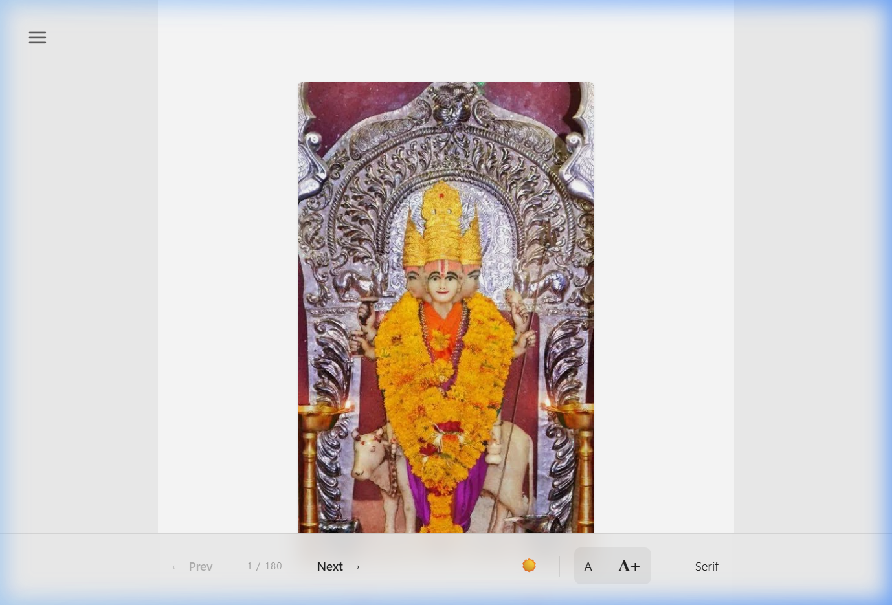
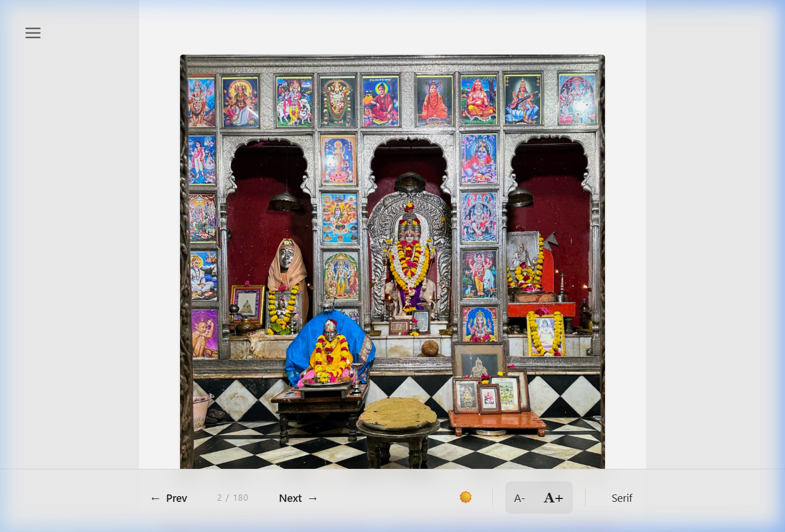

# 🙏 Shri Datta Panchapadi — Digital Edition

A responsive, digitized web application for **Shri Datta Panchapadi**, bringing timeless devotional verses to a modern, beautiful reading experience.

---

## 📸 Preview

| Cover & Navigation | Reader View |
|---|---|
|  |  |

> The fixed utility bar at the bottom provides seamless navigation, theme switching, font size control, and font family switching — all without disrupting the reading layout.

---

## ✨ Features

- **144+ Devotional Items** — Bhupalis, Kakada Aartis, Pads, Bhajans, and Shejaratis
- **Special Pages** — Biography, Daily Programs, Festivals, and Rules
- **3 Themes** — Light ☀️, Dark 🌙, and Papyrus 📜 (ancient scroll texture)
- **Font Size Control** — A+ / A− without disrupting page layout or utility bar position
- **Font Family Toggle** — Serif / Sans / Slab
- **Fixed Utility Bar** — Always visible at the bottom, immune to font-size changes
- **Responsive Design** — Optimized for mobile, tablet, and desktop
- **Marathi Numbering** — Authentic chapter numbering in Marathi script
- **Capacitor Ready** — Prepared for Android & iOS native builds

---

## 🛠 Tech Stack

| Layer | Technology |
|-------|-----------|
| Framework | React 18 + TypeScript |
| Build Tool | Vite |
| Styling | Tailwind CSS v4 |
| State | React Context API |
| Native | Capacitor (Android / iOS) |

---

## 🚀 Getting Started

### Prerequisites

- Node.js v18+
- npm or yarn

### Installation

```bash
# Clone the repository
git clone <repository-url>
cd Panchapadi

# Install dependencies
npm install
```

### Development

```bash
npm run dev
```

Open [http://localhost:5173](http://localhost:5173) in your browser.

### Production Build

```bash
npm run build
```

---

## 📁 Project Structure

```
src/
├── components/
│   ├── Reader/          # ReaderLayout, UtilityBar, ChapterView
│   └── Navigation/      # NavigationMenu
├── context/             # ReaderContext (theme, font, fontSize)
├── data/                # sample-book.ts (all 180 chapters)
├── types/               # TypeScript definitions
└── assets/              # Images and static resources
public/
└── screenshots/         # App preview images (used in README)
```

---

## 📜 License

This project is maintained for devotional and educational purposes.  
Content © Shri Datta Panchapadi Trust.
